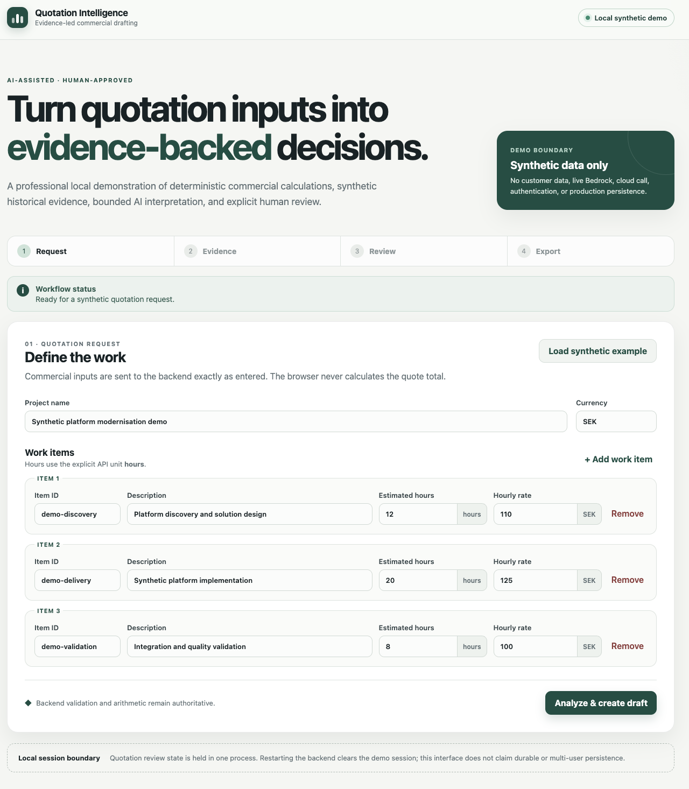

# AI Quotation Intelligence

AI Quotation Intelligence is a local-first V1 system for preparing evidence-backed quotation drafts from historical quotation and outcome data. Deterministic application code owns commercial values and evidence; a bounded AI agent can interpret validated evidence and propose an unapproved draft; a human makes the approval or rejection decision.

> **Portfolio demo: synthetic data only.** The React interface runs locally against the existing FastAPI application with a scripted provider client. It is not a production SaaS, and it does not make live Bedrock calls.

## What V1 delivers

The delivered Cards C01–C20 establish a complete bounded workflow:

- Typed quotation and outcome models, explicit units and currency, synthetic history, deterministic quote calculation and reconciliation.
- Historical estimate-versus-actual comparison, similar-quotation retrieval, and traceable risk statistics with source evidence.
- A provider-isolated Amazon Bedrock Converse adapter, five fixed agent tools, and bounded quotation-agent orchestration with schema, tool, and evidence validation.
- Human review with explicit approve/reject transitions, followed by backend-gated Excel generation and reconciliation.
- A FastAPI application, an isolated S3 storage adapter, AWS deployment and CloudWatch structured events, offline evaluation and guardrail programs, an end-to-end Golden Case, and a local React/TypeScript demo UI.

The principal system boundaries are:

```text
React + TypeScript demo UI
          | same-origin /api via local Vite proxy
          v
      FastAPI API
          |
          +--> QuotationAgent --> five validated AgentTools
          |                          |--> synthetic history / retrieval
          |                          |--> comparisons / statistics / RiskEvidence
          +--> deterministic Core --> quote arithmetic and totals
          +--> Human Review -------> explicit approval or rejection
          +--> Excel Export ------> approved, reconciled workbook
          +--> C14 S3 storage adapter (separate contract) / C16 event logging

QuotationAgent --> provider contract --> Bedrock adapter
                                      (scripted in the local demo)
```

The UI talks to HTTP contracts only. It does not import backend code or calculate authoritative totals, similarity, variance, or risk statistics. The model cannot set rates or totals, invent historical evidence, or approve a quote. Its permitted interpretation is deliberately constrained and validated.

## Local demo

Requirements: Python 3.13 or newer, Node.js/npm versions compatible with the committed lockfile, and the repository files. The demo is synthetic and local; no AWS credentials are needed.

From the repository root, create the Python environment and install the project plus its test tools:

```bash
python3.13 -m venv .venv
source .venv/bin/activate
python -m pip install -e ".[dev]"
```

In one terminal, start the local backend composition:

```bash
cd frontend
npm ci
npm run backend
```

In a second terminal, from `frontend/`, start Vite:

```bash
npm run dev
```

Open <http://127.0.0.1:5173>. The Vite development server proxies relative `/api` requests to the local demo backend at `127.0.0.1:8765`; no backend CORS change is involved. The demo composition uses the real FastAPI application factory, Core, agent/tools, review, and Excel paths, with a deterministic client injected at the existing Bedrock adapter boundary. It does not call AWS or Bedrock. Stop each process with Ctrl-C.

The UI provides free-form synthetic quotation input and a clearly marked example preset. It displays backend-returned draft values, similar quotations, comparisons, and RiskEvidence separately from the constrained AI interpretation. Approval or rejection is an explicit action sent to the backend. Excel download uses the backend export route and remains unavailable until backend approval.



*Local synthetic demo of the V1 quotation workflow; this screenshot does not depict a live Bedrock session.*

## API and component boundaries

The FastAPI application exposes these six routes:

| Method | Route | Purpose |
| --- | --- | --- |
| `GET` | `/health` | Health response |
| `POST` | `/quotes/analyze` | Analyze a validated request |
| `POST` | `/quotes/draft` | Create a draft and process-local review session |
| `GET` | `/quotes/{id}` | Read draft, workflow state, comparisons, similar quotes, and risk evidence |
| `POST` | `/quotes/{id}/approve` | Submit an explicit approval or rejection |
| `POST` | `/quotes/{id}/export` | Return a backend-generated XLSX after approval |

Public quotation inputs require explicit hour units, rates, currency, items, and request time. The API validates requests and returns typed responses; commercial calculations and evidence remain owned by backend components. The agent's fixed tool set is `get_historical_quotes`, `find_similar_quotes`, `calculate_quote_statistics`, `compare_estimate_to_actual`, and `get_risk_evidence`.

Amazon Bedrock is the implemented provider integration. Repository evidence records a successful historical Python Converse smoke test with Amazon Nova Micro. That adapter smoke test is distinct from the local UI, which uses an injected scripted provider, and from the deployed AWS health check, which does not exercise quotation inference.

## Tests and evaluations

From the repository root, run the Python regression suite and architecture tests:

```bash
PYTHONPATH=. python -m pytest -q
PYTHONPATH=. python -m pytest -q tests/test_architecture.py
```

The committed pytest configuration discovers `tests/` and adds `src/` to the import path. To run the governance regression harness:

```bash
bash scripts/test_governance_harness.sh
PYTHONPATH=. python scripts/reconcile_governance_views.py --check
```

The offline C17 evaluation, C18 guardrail matrix, and C19 Golden Case are separate regression evidence:

```bash
PYTHONPATH=. python -m evaluation.c17
PYTHONPATH=. python -m pytest -q tests/test_c18_guardrail_matrix.py
PYTHONPATH=. python -m evaluation.c19
```

From `frontend/`, the package scripts provide type checking, production build, unit/component tests, browser E2E, and bounded mutation probes:

```bash
npm run typecheck
npm run build
npm test
PLAYWRIGHT_BROWSERS_PATH=.playwright-browsers npx playwright install chromium
npm run test:e2e
npm run test:mutations
```

The Playwright flow uses the local frontend and backend. Browser installation is needed only for the browser tests. Generated build output, dependencies, browser binaries, reports, downloads, and caches are not source artifacts.

Recorded delivery evidence includes 513 passing Python tests, 79 architecture tests, 61 Governance Harness checks with no failures, 22 frontend tests, two real Chromium E2E tests, and 11 of 11 applicable UI mutation probes caught. C17 and C19 are deterministic offline regression programs; C18 owns the separate 15-state guardrail matrix. These are recorded project results, not a promise that every environment will produce the same timings or tooling output. See the Evidence Map for the detailed evidence and identities.

## AWS deployment and observability

C15 provides a bounded non-production API Gateway → Lambda → FastAPI deployment. All six routes are IAM-protected. C16 provides structured application events and CloudWatch logging; the project does not claim dashboards, alarms, metrics, or tracing.

A separately authorized read-only AWS verification was **reported** on 2026-10-06 by Codex GPT-6 Luna — Medium, based on a human-supplied execution report. That report states that CloudFormation, Lambda, and API Gateway had the reported healthy configuration; six IAM-authorized routes were present; one SigV4-signed `GET /health` returned HTTP 200 with `{"status":"ok"}`; and a fresh structured health event was observed in CloudWatch and associated by timestamp/invocation window. Artifact-bucket metadata was checked without listing or accessing objects. The original CLI/API output and a durable raw audit artifact were not retained; this README does not present the report as independently reproduced by the documentation task. See [PROJECT_CONTROL.md §13](PROJECT_CONTROL.md#13-aws-state) for provenance, reported scope, and limitations. No infrastructure was changed and no Bedrock inference was reported in that verification.

This proves the bounded deployment and health-path observability claims only. It does **not** prove a live cloud quotation workflow, deployed React UI, Lambda-backed live Bedrock quotation inference, application use of S3 for quote data, or production-scale monitoring. The deployed execution role was verified as log-only for this configuration, without Bedrock or S3 access.

## Security, governance, and limitations

- Historical records and demo inputs are synthetic; do not enter real customer or confidential quotation data.
- Commercial truth is deterministic. The agent interprets validated results, cannot invent totals or evidence, and cannot approve.
- Human approval is mandatory before final quotation export. Excel is generated and gated by the backend.
- `LocalQuoteStore` is process-local and non-durable. Restarting the local backend clears demo review state; it is not safe to treat this as multi-worker or multi-user persistence.
- There is no authentication platform and no publicly deployed frontend. The UI is a local portfolio demonstration, not a production SaaS or mobile application.
- The cloud health check is intentionally narrower than the local quotation workflow. C14's storage adapter is separate evidence; the deployed API role has no S3 permission in the verified configuration.
- The C17 evaluator is a fixed synthetic regression dataset; C18 verifies all 15 canonical guardrail states; C19 proves one fixed synthetic Golden Case across 18 required workflow steps. These do not prove universal commercial correctness, market accuracy, customer suitability, or production readiness.
- C20's independent review accepted a pre-existing OpenAPI documentation mismatch for the export response and an unconfirmed tablet screenshot/header observation as non-blocking; the runtime Excel download was verified separately.

For full contracts, evidence, and rationale, see the [V1 Roadmap](AI_QUOTATION_INTELLIGENCE_V1_ROADMAP.md), [Card Specifications](QUOTATION_CARD_SPECIFICATIONS.md), [Evidence Map](QUOTATION_CARD_EVIDENCE_MAP.md), [Learning and Decision Log](CARD_LEARNING_AND_DECISION_LOG.md), [Commercial and Data Guardrails](COMMERCIAL_AND_DATA_GUARDRAILS.md), [deployment notes](deployment/README.md), and [local frontend guide](frontend/README.md). `PROJECT_CONTROL.md` is the live operational-state authority; this README is explanatory, not a governance state record.

## Project status

C01–C20 are recorded complete and delivered, with no Active Card. Project V1 has been formally finalized and closed. The V1 scope is frozen, with no active Card or V2 work. This README does not claim production readiness.
